<div align="center">

<!-- ═══════════════════════════════════════════════════════════════════════ -->
<!--  PRECISION CUTTING MAT HEADER                                          -->
<!--  Every line measured. Every pixel placed. Every cut intentional.     -->
<!-- ═══════════════════════════════════════════════════════════════════════ -->

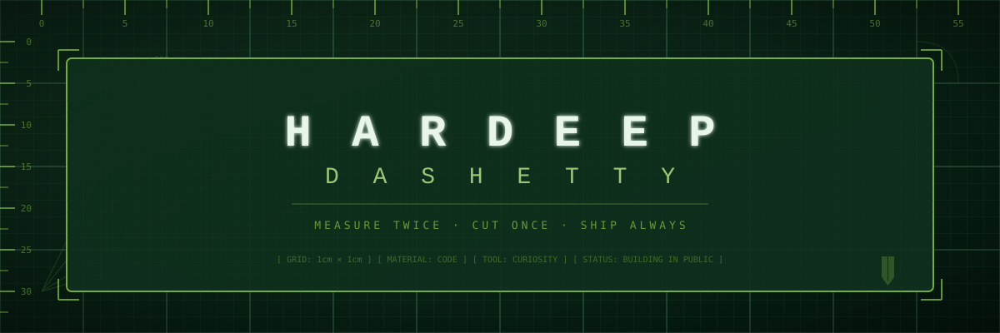

<br><br>

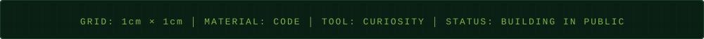

</div>

<!-- ─── WORKBENCH: IDENTITY & PHILOSOPHY ───────────────────────────────── -->
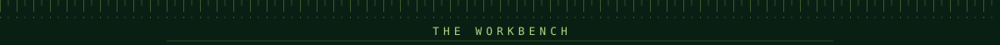

### The Workbench

> *"I don't start things I don't intend to finish. And I don't finish things that aren't worth starting."*

I build software the way a craftsperson builds furniture — with attention to grain, to joint, to the way light hits the surface. Every pixel, every line of code, every word in an interface gets the same scrutiny.

**What drives me:**

```diff
+ Building things people actually use — not portfolio pieces that collect dust
+ The intersection of engineering precision and design intuition
+ Understanding AI deeply enough to know where it helps and where it fails
+ Distributed systems — the architecture of things that scale and survive
+ Graphic design, photography, and any craft where millimeters matter
```

**How I work:**

- **Finisher mentality** — I pick up a task and see it through. No abandoned repos, no half-baked PRs.
- **Pixel-perfect obsession** — My product designer eye doesn't sleep. If something is off by 2px, I *will* notice.
- **Curiosity-first** — Currently submerged in AI, studying system design, and always looking for the edge where technology meets human need.
- **Public by default** — Building in the open. Open repos, open process, open to feedback.

<!-- ─── TOOLKIT: SKILLS ────────────────────────────────────────────────── -->


### Blade Sharpness Matrix

*Every tool has its edge. Here's where mine currently cut:*

<br>

<div align="center">
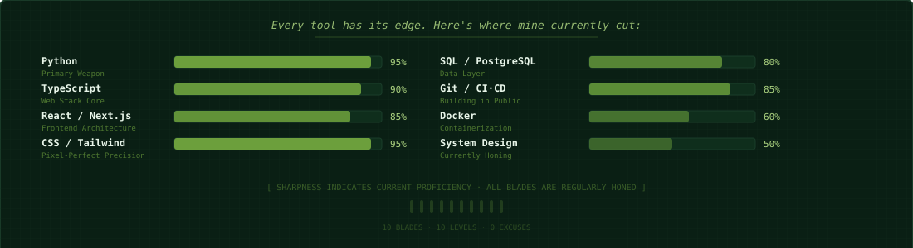
</div>

<br>

<!-- ─── CURRENT CUTS: WORK IN PROGRESS ───────────────────────────────────── -->
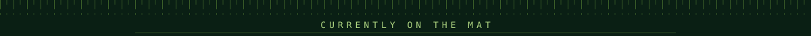

### Currently on the Mat

*Dashed lines mean the cut isn't finished yet. But it will be.*

<br>

<div align="center">
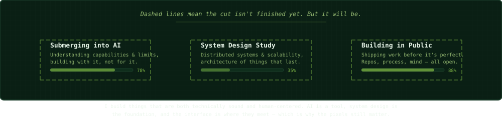
</div>

<br>

Everything I'm building connects back to one question: how do I build things that are both technically sound and human-centered? AI is a tool, system design is the foundation, and the interface is where they meet — which is why the pixels still matter.

<!-- ─── FINISHED CUTS: PROJECTS ──────────────────────────────────────────── -->


### Finished Cuts

*Shipped. Used. Accounted for.*

<br>

<table>
<tr>
<td width="50%">

<a href="https://github.com/Dashetty/Hardeep-Shetty-Portfolio">
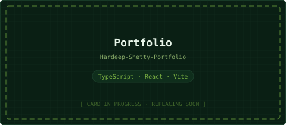
</a>

</td>
<td width="50%">

<a href="https://github.com/Dashetty/Vista-Club-Forms-Collector">
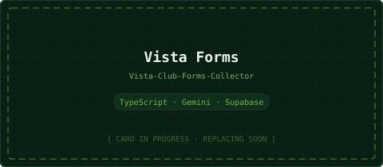
</a>

</td>
</tr>
<tr>
<td width="50%">

<a href="https://github.com/Dashetty/Tumor-Volume-Calculation-using-FDG-PET-">
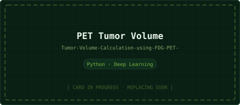
</a>

</td>
<td width="50%">

<a href="https://github.com/Dashetty/LetterboxdQuickPreview">
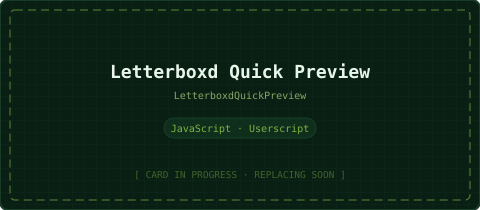
</a>

</td>
</tr>
<tr>
<td width="50%">

<a href="https://github.com/Dashetty/RememeberTada">
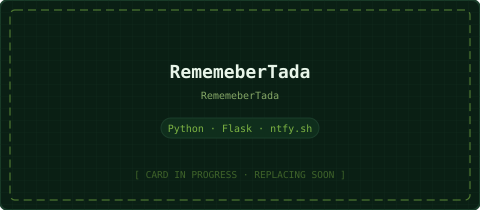
</a>

</td>
<td width="50%">

<!-- Empty slot — intentional flex -->
<pre align="center" style="background:#0a1f14; color:#7cb342; padding:24px; border-radius:6px; border:2px dashed #7cb342; font-family:monospace; font-size:12px;">
┌──────────────────────────┐
│     [  EMPTY  SLOT  ]    │
│                          │
│   Next cut: Loading…   │
│   Sharpness: Calibrating │
│                          │
│   →  Accepting ideas     │
│   →  Open to collab      │
└──────────────────────────┘
</pre>

</td>
</tr>
</table>

<br>

<!-- ─── CONNECT: REGISTRATION MARKS ────────────────────────────────────── -->


### Registration Marks

```
    ╔═══════════════════════════════════════════════════════════════╗
    ║                                                               ║
    ║   Name:              Hardeep Dilip Shetty                    ║
    ║   Alias:             dashetty                                ║
    ║   Location:          Manipal, India                          ║
    ║   Status:            Open to opportunities & collaborations  ║
    ║   Current obsession: AI × System Design × Public Impact      ║
    ║   Side quest:        Design, photography, visual craft       ║
    ║                                                               ║
    ║   →  I build things that get used, not just starred           ║
    ║   →  I finish what I start                                    ║
    ║   →  I notice the 2px misalignment you missed               ║
    ║   →  I'm always learning something new                        ║
    ║                                                               ║
    ╚═══════════════════════════════════════════════════════════════╝
```

<br>

<div align="center">

[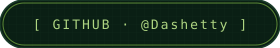](https://github.com/Dashetty)
[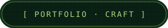](https://github.com/Dashetty/Hardeep-Shetty-Portfolio)

<br><br>

```
┌─────────────────────────────────────────────────────────────────────────────────┐
│  [ 0 ]────[ 10 ]────[ 20 ]────[ 30 ]────[ 40 ]────[ 50 ]────[ 60 ] cm          │
└─────────────────────────────────────────────────────────────────────────────────┘
```

*Measure twice. Cut once. Ship always.*

</div>

<!-- ═══════════════════════════════════════════════════════════════════════ -->
<!--  END OF MAT — all cuts accounted for, grid cleared, tools sheathed    -->
<!-- ═══════════════════════════════════════════════════════════════════════ -->


