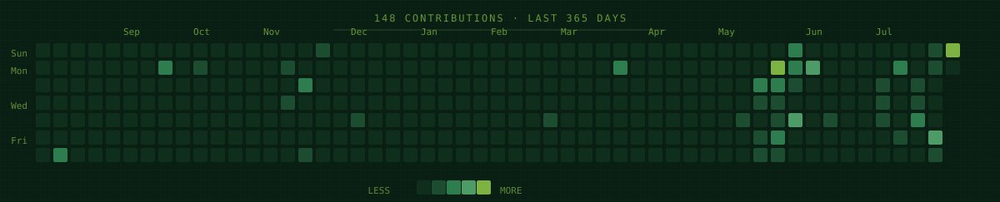
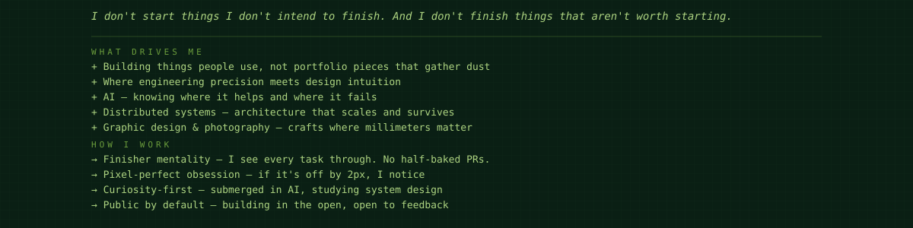
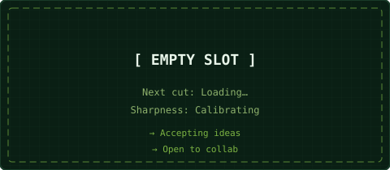
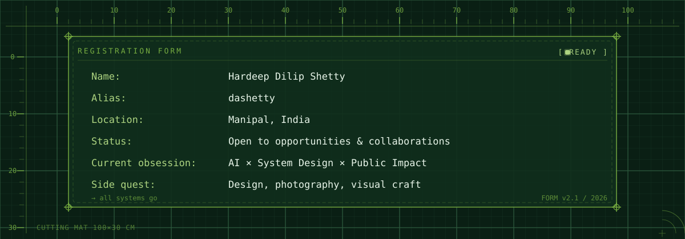

<!-- ═══════════════════════════════════════════════════════════════════════ -->
<!--  PRECISION CUTTING MAT PROFILE                                          -->
<!--  Every line measured. Every pixel placed. Every cut intentional.     -->
<!-- ═══════════════════════════════════════════════════════════════════════ -->

  

  

<!-- ─── WORKBENCH: IDENTITY & PHILOSOPHY ───────────────────────────────── -->

<!-- ─── TOOLKIT: SKILLS ────────────────────────────────────────────────── -->

<!-- ─── CURRENT CUTS: WORK IN PROGRESS ───────────────────────────────────── -->

<!-- ─── FINISHED CUTS: PROJECTS ──────────────────────────────────────────── -->

<table>
<tr>
<td width="50%">

</td>
<td width="50%">

</td>
</tr>
<tr>
<td width="50%">

</td>
<td width="50%">

</td>
</tr>
<tr>
<td width="50%">

</td>
<td width="50%">

</td>
</tr>
</table>

<!-- ─── CONNECT: REGISTRATION MARKS ────────────────────────────────────── -->

 

